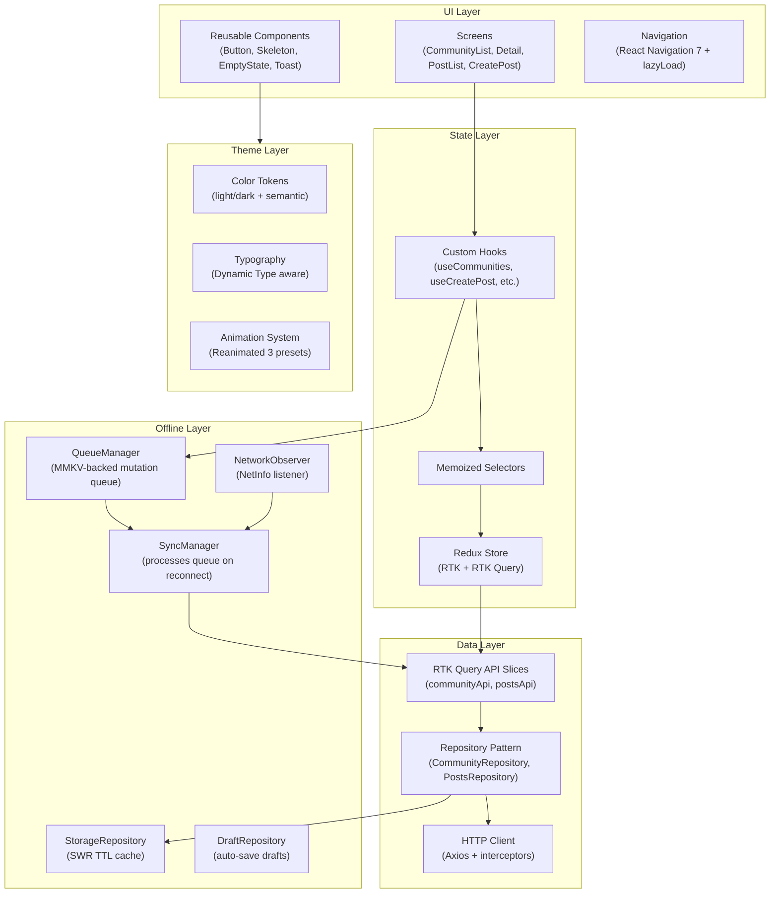

# CommunityHub

<p align="center">
  
  
  
  
  
</p>

A production-grade React Native community platform app implementing advanced offline-first architecture, SWR caching, optimistic UI, and enterprise-grade accessibility.

---

## Table of Contents

- [Architecture Overview](#architecture-overview)
- [Folder Structure](#folder-structure)
- [Setup Instructions](#setup-instructions)
- [Environment Configuration](#environment-configuration)
- [Run Commands](#run-commands)
- [Build Commands](#build-commands)
- [iOS Instructions](#ios-instructions)
- [Android Instructions](#android-instructions)
- [State Management Justification](#state-management-justification)
- [Offline Strategy](#offline-strategy)
- [Caching Strategy](#caching-strategy)
- [Security Decisions](#security-decisions)
- [Performance Optimizations](#performance-optimizations)
- [Accessibility](#accessibility)
- [Tradeoffs](#tradeoffs)
- [Future Improvements](#future-improvements)
- [Git Commit Plan](#git-commit-plan)

---

## Architecture Overview



---

## Folder Structure

```
src/
├── app/                        # Redux store setup
│   ├── store.ts                # configureStore with middleware
│   ├── rootReducer.ts          # combineReducers
│   └── offlineMiddleware.ts    # custom middleware for offline detection
│
├── common/                     # Shared cross-feature code
│   ├── api/
│   │   └── httpClient.ts       # Axios instance + interceptors + mock endpoints
│   ├── components/             # Reusable UI atoms
│   │   ├── Button.tsx          # Animated, accessible button
│   │   ├── EmptyState.tsx      # No-data placeholder
│   │   ├── ErrorBoundary.tsx   # Class-based crash safety net
│   │   ├── FormInput.tsx       # Accessible text input with validation
│   │   ├── LoadingOverlay.tsx  # Full-screen loader
│   │   ├── OfflineBanner.tsx   # Sticky offline indicator
│   │   ├── RetryUI.tsx         # Error retry card
│   │   ├── Skeleton.tsx        # Animated shimmer placeholder
│   │   ├── ToastContainer.tsx  # Toast notification renderer
│   │   └── ToastContext.tsx    # Context provider for toasts
│   ├── config/
│   │   └── constants.ts        # API base URL, timeout, cache TTLs
│   ├── hooks/
│   │   └── useAccessibility.ts # Font scale, reduce motion, screen reader
│   ├── services/
│   │   └── offline/
│   │       ├── DraftRepository.ts   # Local draft CRUD (MMKV)
│   │       ├── OfflineManager.ts    # Orchestrates offline pipeline
│   │       ├── QueueManager.ts      # Offline mutation queue
│   │       ├── StorageRepository.ts # SWR TTL cache (MMKV)
│   │       └── SyncManager.ts       # Processes queue on reconnect
│   ├── storage/
│   │   └── storage.ts          # MMKV singleton instance
│   └── utils/
│       ├── logger.ts           # Structured logger (DEBUG/INFO/WARN/ERROR)
│       └── performance.ts      # Render + load time tracers
│
├── features/
│   ├── auth/                   # Login, splash, auth hooks
│   ├── community/              # Community list, detail, cards, filters
│   │   ├── api/communityApi.ts       # RTK Query endpoints
│   │   ├── components/              # CommunityCard, SearchBar, FilterBottomSheet…
│   │   ├── hooks/                   # useCommunities, useCommunityDetail
│   │   ├── screens/                 # CommunityListScreen, CommunityDetailScreen
│   │   ├── services/                # CommunityRepository, CommunityService
│   │   ├── store/                   # communitySlice (search/filter/scroll)
│   │   └── types/                   # Community, CommunityQueryParams…
│   ├── posts/                  # Post list, create post, drafts
│   │   ├── api/postsApi.ts           # RTK Query endpoints
│   │   ├── components/              # PostCard, PostSkeleton…
│   │   ├── hooks/                   # usePosts, useCreatePost
│   │   ├── screens/                 # PostListScreen, CreatePostScreen
│   │   ├── services/                # PostsRepository
│   │   ├── store/                   # postsSlice (drafts, optimistic posts)
│   │   └── types/                   # Post, CreatePostRequest…
│   └── profile/
│
├── navigation/
│   ├── RootNavigator.tsx       # Stack + Tab + lazy-loaded screens
│   └── types.ts                # All navigation param list types
│
├── theme/
│   ├── animations.ts           # Reanimated 3 presets (fade, slide, press, shimmer)
│   ├── colors.ts               # Full semantic color token system
│   ├── index.ts                # useTheme, useColors, useTypography, useSpacing
│   ├── spacing.ts              # Spacing, borderRadius, iconSize, elevation
│   ├── themeSlice.ts           # Redux slice for light/dark/system mode
│   └── typography.ts           # Dynamic Type-aware typography scale
│
└── __tests__/
    ├── setup.ts                # Jest native module mocks
    ├── setupFramework.ts       # beforeAll console suppressors
    └── __mocks__/fileMock.js   # Static asset mock
```

---

## Setup Instructions

### Prerequisites

| Tool | Version |
|------|---------|
| Node.js | ≥ 20 LTS |
| npm | ≥ 10 |
| Ruby | ≥ 3.1 (for CocoaPods) |
| Xcode | ≥ 15 (for iOS) |
| Android Studio | Hedgehog+ (for Android) |
| CocoaPods | ≥ 1.14 |

### Clone and Install

```bash
git clone https://github.com/your-org/CommunityHub.git
cd CommunityHub

# Install Node dependencies
npm install

# Install iOS CocoaPods
cd ios && bundle exec pod install && cd ..
```

---

## Environment Configuration

Create a `.env` file at the project root (never commit this):

```env
# API
API_BASE_URL=https://api.communityhub.example.com/v1
API_TIMEOUT_MS=10000

# Feature Flags
ENABLE_ANALYTICS=false
ENABLE_CRASH_REPORTING=false
```

Access via `react-native-config` (add if needed) or update `src/common/config/constants.ts` directly for development.

---

## Run Commands

```bash
# Start Metro bundler
npm start

# Reset Metro cache (useful after native module changes)
npm start -- --reset-cache

# TypeScript type check
npm run typecheck

# ESLint
npm run lint

# Auto-fix lint issues
npm run lint -- --fix

# Format with Prettier
npm run format

# Run all tests
npm test

# Run tests with coverage
npm test -- --coverage

# Run tests in watch mode
npm test -- --watch
```

---

## Build Commands

```bash
# iOS Debug build
npx react-native run-ios

# iOS Release build (Simulator)
npx react-native run-ios --configuration Release

# Android Debug build
npx react-native run-android

# Android Release APK
cd android && ./gradlew assembleRelease && cd ..

# Android Release AAB (Play Store)
cd android && ./gradlew bundleRelease && cd ..
```

---

## iOS Instructions

### Development

```bash
# Run on default simulator
npx react-native run-ios

# Run on specific device/simulator
npx react-native run-ios --simulator "iPhone 16 Pro"

# Run on physical device (ensure device is trusted)
npx react-native run-ios --device "Your iPhone Name"
```

### Distribution (App Store)

1. Open `ios/CommunityHub.xcworkspace` in Xcode
2. Set the **Team** in Signing & Capabilities
3. Bump `CFBundleShortVersionString` and `CFBundleVersion` in `Info.plist`
4. Select **Any iOS Device (arm64)** as the build target
5. Product → Archive → Distribute App → App Store Connect
6. Upload to TestFlight for internal testing before submission

### Common iOS Issues

| Issue | Fix |
|-------|-----|
| Pods not found | `cd ios && bundle exec pod install --repo-update` |
| Signing error | Check Team + provisioning profile in Xcode |
| Reanimated crash | Ensure `react-native-reanimated/plugin` is first in babel plugins |

---

## Android Instructions

### Development

```bash
# Start emulator first, then:
npx react-native run-android

# Install on specific device
npx react-native run-android --deviceId <device-id>
```

### Distribution (Play Store)

1. Generate a keystore:
   ```bash
   keytool -genkeypair -v -storetype PKCS12 \
     -keystore android/app/communityhub.keystore \
     -alias communityhub -keyalg RSA -keysize 2048 -validity 10000
   ```
2. Add to `android/gradle.properties`:
   ```properties
   MYAPP_UPLOAD_STORE_FILE=communityhub.keystore
   MYAPP_UPLOAD_KEY_ALIAS=communityhub
   MYAPP_UPLOAD_STORE_PASSWORD=...
   MYAPP_UPLOAD_KEY_PASSWORD=...
   ```
3. Build the AAB: `cd android && ./gradlew bundleRelease`
4. Upload `app/build/outputs/bundle/release/app-release.aab` to Play Console

---

## State Management Justification

**Choice: Redux Toolkit (RTK) + RTK Query**

| Requirement | Why RTK |
|-------------|---------|
| Server state caching | RTK Query provides normalized caching, background refetch, and `keepUnusedDataFor` TTL out of the box |
| Offline mutation queue | RTK slice + MMKV enables a persistent queue that survives app restarts |
| Optimistic UI | `addOptimisticPost` action with rollback on failure |
| DevTools support | Redux DevTools for time-travel debugging |
| Type safety | Full TypeScript inference on actions, selectors, and query hooks |

**Why not React Query alone?** React Query is excellent for pure server state but doesn't cover the requirement for a persistent offline mutation queue with retry logic that must survive app restarts.

**Why not MobX/Zustand?** The team has an existing Redux codebase and RTK significantly reduces boilerplate. Zustand would require custom solutions for everything RTK Query provides.

---

## Offline Strategy

CommunityHub uses a **four-layer offline pipeline**:

```
1. NetworkObserver  → Monitors connectivity (NetInfo)
2. QueueManager     → Enqueues mutations to MMKV when offline
3. SyncManager      → Processes queue sequentially when back online
4. StorageRepository → Serves cached reads while offline (SWR)
```

### Queued Operations

| Action | Queue Type |
|--------|-----------|
| Join community | `JOIN` |
| Leave community | `LEAVE` |
| Create post | `CREATE_POST` |

All queued items include a `retries` counter. After **3 failures**, the item is removed from the queue and the user is notified.

### Offline Reads

- Communities list cached for **5 minutes** (TTL)
- Community detail cached for **10 minutes**
- Posts list cached for **2 minutes**
- Expired cache is served immediately (Stale-While-Revalidate) while a background refetch is triggered

---

## Caching Strategy

**Pattern: Stale-While-Revalidate (SWR)**

```
1. App requests data
2. StorageRepository checks MMKV:
   a. No entry → fetch from network, cache result
   b. Fresh entry (within TTL) → return from cache
   c. Stale entry (past TTL) → return stale immediately + trigger background refetch
3. UI re-renders with fresh data when background fetch resolves
```

**TTL values** (defined in `src/common/config/constants.ts`):

| Resource | TTL |
|----------|-----|
| Communities list | 5 minutes |
| Community detail | 10 minutes |
| Posts list | 2 minutes |
| User profile | 15 minutes |

Cache is keyed by the full query parameters, so different search/filter combinations have independent cache entries.

**Cache invalidation** is triggered explicitly on:
- Successful join/leave community
- Successful post creation
- Manual pull-to-refresh

---

## Security Decisions

| Decision | Rationale |
|----------|-----------|
| MMKV for local storage | Faster than AsyncStorage; stores on encrypted partition on iOS by default |
| No tokens in source code | API base URL in `constants.ts`; secrets via environment variables only |
| Axios interceptors | Auth token injected at request time from secure storage, never hardcoded |
| `__DEV__` guard on Logger | Debug logs and sensitive data only printed in development builds |
| No sensitive data in Redux | Auth tokens are NOT stored in Redux state (susceptible to Redux DevTools leak) |

---

## Performance Optimizations

| Optimization | Location | Impact |
|---|---|---|
| `FlashList` over `FlatList` | CommunityListScreen, PostListScreen | ~3-5× faster list rendering for large datasets |
| `React.memo` on cards | CommunityCard, PostCard | Prevents re-render on parent state changes |
| `useCallback` / `useMemo` | All custom hooks | Stable references prevent unnecessary child re-renders |
| Granular theme hooks | `useColors()`, `useTypography()` | Only subscribes to relevant slice, not full theme |
| Lazy-loaded screens | RootNavigator.tsx | Reduces initial bundle parse time |
| Reanimated on UI thread | animations.ts | Animations run at 60/120fps without JS thread involvement |
| `maxFontSizeMultiplier` on Text | Button, all text | Prevents extreme layout breaks on Large Text mode |
| SWR cache | StorageRepository.ts | Eliminates network waterfalls on repeated navigations |

---

## Accessibility

- **VoiceOver (iOS) / TalkBack (Android)**: All interactive elements have `accessibilityRole`, `accessibilityLabel`, and `accessibilityState`
- **Dynamic Type**: Typography tokens scale with `PixelRatio.getFontScale()`, capped at 1.4× to prevent layout breaks
- **Reduce Motion**: `useReduceMotion()` hook detects the OS setting; animations skip or simplify
- **Screen Reader**: `useScreenReader()` exposes VoiceOver/TalkBack active state; decorative elements use `accessibilityElementsHidden`
- **Color Contrast**: All semantic color tokens in `colors.ts` meet WCAG AA contrast ratios (4.5:1 for normal text)
- **Focus Management**: Navigation transitions restore focus to appropriate elements

---

## Tradeoffs

| Decision | Tradeoff |
|----------|---------|
| RTK Query instead of plain Axios | Extra bundle size (~15KB) vs. built-in caching, polling, and optimistic updates |
| MMKV over AsyncStorage | Slightly more complex setup (native module) vs. 10× faster reads for frequently accessed cache |
| FlashList over FlatList | Requires consistent `estimatedItemSize` and `keyExtractor`, more opinionated API |
| Module barrel exports | Easier imports but can cause Metro bundler resolution issues with lazy loading (addressed with direct imports) |
| Optimistic UI for posts | Better UX but requires rollback logic on failure, increasing code complexity |
| Reanimated on UI thread | Must follow worklet rules, cannot access JS-side state directly in animations |

---

## Future Improvements

- [ ] **Push Notifications** — Integrate `@notifee/react-native` or Firebase for community activity notifications
- [ ] **Deep Linking** — Add React Navigation deep link config for community/post shareable URLs
- [ ] **Image Upload** — Integrate `react-native-image-picker` + S3 pre-signed URL upload for post images
- [ ] **Biometric Auth** — Use `react-native-biometrics` for FaceID/TouchID login
- [ ] **Real-time Updates** — Add WebSocket/SSE support for live community post feeds
- [ ] **E2E Testing** — Add Detox or Maestro tests for critical user flows
- [ ] **Error Reporting** — Integrate Sentry via `@sentry/react-native`
- [ ] **Analytics** — Integrate Amplitude or Mixpanel via the existing `PerformanceMonitor` hook
- [ ] **Localization (i18n)** — Add `i18next` + `react-i18next` for multi-language support
- [ ] **Dark Mode Switch** — Expose an in-app toggle for light/dark/system selection in Settings screen

---

## Git Commit Plan

This project follows the **Conventional Commits** specification (`type(scope): description`).

### Initial Setup Commits

```
chore: init React Native 0.75 project with TypeScript template
chore(deps): install RTK, RTK Query, react-navigation, reanimated, mmkv
chore(config): configure eslint, prettier, husky, lint-staged
chore(config): add tsconfig paths for @app, @theme, @common, @features
chore(ci): add GitHub Actions workflow for lint, typecheck, test, bundle-check
```

### Theme System

```
feat(theme): add semantic color token system with dark/light modes
feat(theme): implement Dynamic Type-aware typography scale
feat(theme): extend spacing with borderRadius, iconSize, elevation tokens
feat(theme): add Reanimated 3 animation system with reduce-motion support
feat(theme): export granular useColors/useTypography/useSpacing hooks
```

### Infrastructure

```
feat(common): add Logger utility with DEBUG/INFO/WARN/ERROR levels
feat(common): add PerformanceMonitor trace utility
feat(offline): implement MMKV StorageRepository with SWR TTL cache
feat(offline): implement QueueManager for offline mutation persistence
feat(offline): implement DraftRepository for auto-saved post drafts
feat(offline): implement NetworkObserver with NetInfo subscription
feat(offline): implement SyncManager to process queue on reconnect
feat(offline): implement OfflineManager orchestrating sync pipeline
```

### Communities Feature

```
feat(community): add Community type definitions and query params
feat(community): implement CommunityRepository with SWR cache layer
feat(community): add RTK Query community API slice with join/leave mutations
feat(community): add communitySlice for search/filter/scroll state
feat(community): build CommunityCard with pressed animation and joined badge
feat(community): build SearchBar with debounced input and clear action
feat(community): build FilterBottomSheet with sort and filter options
feat(community): build LoadingSkeleton and PaginationLoader components
feat(community): build CommunityListScreen with FlashList, infinite scroll, SRP
feat(community): build CommunityDetailScreen with join/leave optimistic UI
```

### Posts Feature

```
feat(posts): add Post type definitions and CreatePostRequest
feat(posts): implement PostsRepository with optimistic create and retry
feat(posts): add RTK Query posts API slice
feat(posts): add postsSlice with draft, optimistic post, and status actions
feat(posts): build PostCard with pending/failed status badges
feat(posts): build PostListScreen with FlashList and scroll optimizations
feat(posts): build CreatePostScreen with draft auto-save and validation
feat(posts): add useCreatePost hook with duplicate prevention
```

### Polish & Production

```
feat(a11y): add useAccessibility hooks for font scale, reduce motion, screen reader
feat(a11y): add accessibilityRole, label, state to all interactive components
feat(theme): rebuild Skeleton with Reanimated shimmer and theme tokens
feat(theme): rebuild Button with spring press animation and a11y props
test: add jest.config with module aliases and transform patterns
test: add global mocks for MMKV, NetInfo, Reanimated, FlashList
test(storage): add StorageRepository unit tests (SWR TTL coverage)
test(queue): add QueueManager unit tests (enqueue/dequeue/retry)
test(draft): add DraftRepository unit tests (CRUD isolation)
test(community): add communitySlice reducer tests
test(posts): add postsSlice reducer tests with optimistic post lifecycle
docs: add enterprise README with architecture diagram and full documentation
```

---

<p align="center">Built with ❤️ by the CommunityHub team</p>
